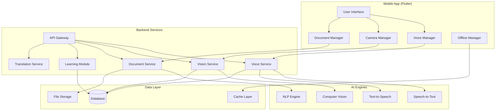

# Design Document: KarigAI - The Vernacular Digital Foreman

## Overview

KarigAI is a voice-first, multimodal mobile application designed to empower India's informal workforce through AI-powered assistance in local dialects. The system combines speech recognition, computer vision, natural language processing, and document generation to bridge the gap between traditional skills and modern digital workflows.

The architecture supports two deployment strategies: a high-velocity stack using paid APIs for rapid development and deployment, and an open-source stack for cost-conscious implementations. The system prioritizes offline functionality, multilingual support, and user privacy while maintaining professional-grade output quality.

## Architecture

### High-Level System Architecture



### Technology Stack Options

#### Option 1: High Velocity Stack (Paid APIs)
- **Frontend**: Flutter 3.x with Dart
- **Backend**: Python FastAPI or Node.js Express
- **Speech Recognition**: OpenAI Whisper API
- **Text-to-Speech**: ElevenLabs or Azure Cognitive Services
- **Computer Vision**: OpenAI GPT-4V or Google Vision API
- **NLP**: OpenAI GPT-4 or Google Gemini Pro
- **Document Generation**: PDFKit or DocRaptor
- **Database**: PostgreSQL with Redis cache
- **Deployment**: AWS/GCP with Docker containers

#### Option 2: Open Source Stack (Zero Cost)
- **Frontend**: Flutter 3.x with Dart
- **Backend**: Python Flask hosted on Google Colab with Ngrok tunneling
- **Speech Recognition**: Faster-Whisper (local inference)
- **Text-to-Speech**: Coqui TTS or Edge-TTS
- **Computer Vision**: LLaVA or BakLLaVA models
- **NLP**: Llama 3 or Mistral models
- **Document Generation**: ReportLab (Python) or jsPDF
- **Database**: SQLite with local caching
- **Deployment**: Google Colab (requires session management)

## Components and Interfaces

### Voice Engine Component

**Responsibilities:**
- Speech-to-text conversion in multiple Indian languages
- Text-to-speech synthesis with natural pronunciation
- Language detection and dialect recognition
- Audio preprocessing and noise reduction

**Key Interfaces:**
```dart
abstract class VoiceEngine {
  Future<String> speechToText(AudioData audio, String languageCode);
  Future<AudioData> textToSpeech(String text, String languageCode);
  Future<String> detectLanguage(AudioData audio);
  Future<bool> isLanguageSupported(String languageCode);
}
```

**Implementation Details:**
- Supports Hindi, English, Malayalam, Dogri, Punjabi, Bengali, Tamil, Telugu
- Handles code-mixed speech (Hinglish, regional variations)
- Implements noise cancellation for field environments
- Provides confidence scores for recognition accuracy
- Caches frequently used audio patterns for offline use

### Vision Engine Component

**Responsibilities:**
- Equipment and error code recognition
- Pattern and design analysis
- Quality assessment for products
- OCR for text extraction from images

**Key Interfaces:**
```dart
abstract class VisionEngine {
  Future<EquipmentInfo> identifyEquipment(ImageData image);
  Future<List<ErrorCode>> detectErrorCodes(ImageData image);
  Future<PatternAnalysis> analyzePattern(ImageData image);
  Future<QualityAssessment> assessQuality(ImageData image, ProductType type);
  Future<String> extractText(ImageData image, String languageCode);
}
```

**Implementation Details:**
- Pre-trained models for common Indian equipment brands
- Custom pattern recognition for traditional designs
- Quality grading algorithms for agricultural products
- Multi-language OCR supporting Devanagari, Latin scripts
- Edge processing capabilities for offline operation

### Document Generator Component

**Responsibilities:**
- Professional invoice generation
- Multi-language document creation
- Template management and customization
- Digital signature and watermarking

**Key Interfaces:**
```dart
abstract class DocumentGenerator {
  Future<PDFDocument> generateInvoice(InvoiceData data, String template);
  Future<PDFDocument> createReport(ReportData data, String languageCode);
  Future<List<String>> getAvailableTemplates();
  Future<bool> addCustomTemplate(String templateId, TemplateData template);
}
```

**Implementation Details:**
- Bilingual invoice templates (English/Hindi)
- Automatic tax calculation and compliance
- WhatsApp integration for document sharing
- Digital watermarking for authenticity
- Offline template caching

### Learning Module Component

**Responsibilities:**
- Micro-course content delivery
- Progress tracking and analytics
- Personalized learning recommendations
- Offline content synchronization

**Key Interfaces:**
```dart
abstract class LearningModule {
  Future<List<MicroSOP>> getRecommendedCourses(UserProfile profile);
  Future<MicroSOP> getCourse(String courseId, String languageCode);
  Future<void> trackProgress(String courseId, ProgressData progress);
  Future<List<MicroSOP>> getOfflineCourses();
}
```

**Implementation Details:**
- 30-second interactive modules with voice narration
- Location and trade-specific content curation
- Gamification elements for engagement
- Offline-first architecture with sync capabilities

## Data Models

### Core Data Structures

```dart
class UserProfile {
  String userId;
  String primaryLanguage;
  List<String> secondaryLanguages;
  TradeType trade;
  LocationInfo location;
  List<String> skillTags;
  DateTime lastActive;
}

class VoiceSession {
  String sessionId;
  AudioData inputAudio;
  String transcribedText;
  String detectedLanguage;
  double confidenceScore;
  DateTime timestamp;
}

class InvoiceData {
  String customerId;
  String customerName;
  List<ServiceItem> services;
  double totalAmount;
  String warrantyInfo;
  DateTime serviceDate;
  String notes;
}

class EquipmentInfo {
  String equipmentId;
  String brand;
  String model;
  String category;
  List<String> commonIssues;
  List<TroubleshootingStep> procedures;
}

class MicroSOP {
  String courseId;
  String title;
  String description;
  int durationSeconds;
  List<String> supportedLanguages;
  List<LearningStep> steps;
  List<String> prerequisites;
}
```

### Database Schema

**Users Table:**
- user_id (Primary Key)
- phone_number (Unique)
- primary_language
- trade_type
- location_data (JSON)
- created_at, updated_at

**Voice_Sessions Table:**
- session_id (Primary Key)
- user_id (Foreign Key)
- audio_file_path
- transcribed_text
- language_detected
- confidence_score
- created_at

**Documents Table:**
- document_id (Primary Key)
- user_id (Foreign Key)
- document_type
- file_path
- metadata (JSON)
- created_at

**Learning_Progress Table:**
- progress_id (Primary Key)
- user_id (Foreign Key)
- course_id
- completion_percentage
- last_accessed
- quiz_scores (JSON)

## Correctness Properties

*A property is a characteristic or behavior that should hold true across all valid executions of a system—essentially, a formal statement about what the system should do. Properties serve as the bridge between human-readable specifications and machine-verifiable correctness guarantees.*

Based on the prework analysis, here are the consolidated correctness properties:

**Property 1: Voice Recognition Completeness**
*For any* voice input in supported local dialects, the Voice_Engine should produce structured data containing all identifiable invoice fields, service details, or query parameters
**Validates: Requirements 1.1, 7.1, 7.5**

**Property 2: Document Generation Consistency**
*For any* valid invoice data, the Document_Generator should create PDF documents containing all required fields in both English and Hindi, including warranty clauses and service details
**Validates: Requirements 1.2, 1.3**

**Property 3: Currency Validation and Formatting**
*For any* voice input containing pricing information, the system should validate and format currency amounts into a consistent standard format (₹X,XXX.XX)
**Validates: Requirements 1.5**

**Property 4: WhatsApp Integration Reliability**
*For any* generated invoice document, the WhatsApp integration should successfully deliver the PDF when requested
**Validates: Requirements 1.4**

**Property 5: Vision Analysis Completeness**
*For any* captured image of equipment, patterns, or products, the Vision_Engine should return analysis results with confidence scores and relevant metadata
**Validates: Requirements 2.1, 4.1, 5.1**

**Property 6: Troubleshooting Information Retrieval**
*For any* identified equipment, the system should retrieve and provide relevant troubleshooting procedures or general diagnostic approaches
**Validates: Requirements 2.2, 2.5**

**Property 7: Technical Content Translation**
*For any* technical instructions or troubleshooting steps, the system should convert content to Local_Dialect voice guidance while preserving technical accuracy
**Validates: Requirements 2.3, 7.3**

**Property 8: Content Structuring**
*For any* complex procedure or technical content, the system should break it down into discrete, actionable steps
**Validates: Requirements 2.4**

**Property 9: Learning Recommendation Accuracy**
*For any* user with repeated similar queries, the Learning_Module should identify knowledge gaps and suggest relevant Micro_SOPs
**Validates: Requirements 3.1**

**Property 10: Micro-SOP Delivery Format**
*For any* delivered Micro_SOP, the system should present it as an interactive module in Local_Dialect within 30 seconds duration
**Validates: Requirements 3.2**

**Property 11: Content Personalization**
*For any* learning content or promotional material, the system should customize content based on user's location and trade profile
**Validates: Requirements 3.3, 6.4**

**Property 12: Progress Tracking and Recommendations**
*For any* completed Micro_SOP, the system should track progress and suggest appropriate follow-up learning opportunities
**Validates: Requirements 3.4**

**Property 13: Design Generation with Preservation**
*For any* analyzed traditional pattern, the system should generate modern variations while maintaining identifiable core traditional elements
**Validates: Requirements 4.2**

**Property 14: Market Context Provision**
*For any* design variation or quality assessment, the system should provide market trend context and pricing suggestions
**Validates: Requirements 4.3, 5.3**

**Property 15: Multilingual Explanation Capability**
*For any* design modification, quality issue, or system response, explanations should be provided in the user's preferred Local_Dialect
**Validates: Requirements 4.4, 5.4**

**Property 16: Data Persistence and Retrieval**
*For any* saved design or assessed product, the system should maintain retrievable records in personal libraries or batch summaries
**Validates: Requirements 4.5, 5.5**

**Property 17: Quality Assessment Standardization**
*For any* product quality analysis, the system should provide grading information based on established market standards
**Validates: Requirements 5.2**

**Property 18: Knowledge Base Query Response**
*For any* local information query about plants, attractions, or regional features, the system should provide detailed explanations and identification
**Validates: Requirements 6.1**

**Property 19: Multilingual Content Generation**
*For any* guest information or booking communication, the system should generate professional content in multiple specified languages (English, French, Hindi)
**Validates: Requirements 6.2, 6.5**

**Property 20: Language Register Transformation**
*For any* colloquial input, the system should translate to formal business language while maintaining meaning and technical accuracy
**Validates: Requirements 7.2, 7.3**

**Property 21: Offline Functionality Preservation**
*For any* core feature (voice recognition, document generation, learning modules), basic functionality should remain available without network connectivity using cached data
**Validates: Requirements 8.1, 8.2**

**Property 22: Data Synchronization Consistency**
*For any* offline-generated content, the system should sync all changes when connectivity is restored without data loss
**Validates: Requirements 8.3**

**Property 23: Offline Feature Indication**
*For any* system operation in offline mode, the interface should clearly indicate which features are available without network access
**Validates: Requirements 8.4**

**Property 24: Storage Prioritization Algorithm**
*For any* offline storage approaching capacity limits, the system should prioritize retention of most frequently used content based on usage patterns
**Validates: Requirements 8.5**

**Property 25: Data Security and Privacy**
*For any* voice data processing, customer information storage, or analytics collection, the system should implement encryption, require explicit consent, and anonymize personal identifiers
**Validates: Requirements 9.1, 9.2, 9.3, 9.5**

**Property 26: Data Deletion Compliance**
*For any* user data deletion request, the system should remove all associated personal data within 30 days
**Validates: Requirements 9.4**

**Property 27: Performance Timing Requirements**
*For any* voice processing, document generation, or image analysis, the system should meet specified response time limits (3s, 5s, 10s respectively)
**Validates: Requirements 10.1, 10.2, 10.3**

**Property 28: Load Performance Maintenance**
*For any* high system load condition, response times should remain within acceptable limits through proper resource management
**Validates: Requirements 10.4**

**Property 29: Caching Performance Optimization**
*For any* frequently accessed feature, subsequent access should show improved response times through effective caching
**Validates: Requirements 10.5**

<function_calls>
<invoke name="prework">
<parameter name="featureName">karigai
## Error Handling

### Voice Recognition Error Handling
- **Low Confidence Scores**: When speech recognition confidence falls below 80%, prompt user for clarification
- **Unsupported Languages**: Gracefully fallback to English or Hindi when dialect is not supported
- **Audio Quality Issues**: Implement noise reduction and request re-recording for poor audio quality
- **Network Timeouts**: Cache partial results and retry with exponential backoff

### Vision Processing Error Handling
- **Unrecognizable Images**: Provide general guidance when specific equipment cannot be identified
- **Poor Image Quality**: Guide users to improve lighting and focus before re-capturing
- **Unsupported Equipment**: Offer to learn from user input and expand knowledge base
- **Processing Failures**: Fallback to basic OCR text extraction when advanced analysis fails

### Document Generation Error Handling
- **Missing Data Fields**: Use default values and clearly mark incomplete sections
- **Template Errors**: Fallback to basic template when custom templates fail to load
- **File System Issues**: Implement retry logic and temporary storage alternatives
- **WhatsApp Integration Failures**: Provide alternative sharing methods (email, direct download)

### Offline Mode Error Handling
- **Storage Limitations**: Implement intelligent cache eviction based on usage patterns
- **Sync Conflicts**: Use timestamp-based conflict resolution with user notification
- **Partial Functionality**: Clearly communicate feature limitations in offline mode
- **Data Corruption**: Implement checksums and automatic repair mechanisms

## Testing Strategy

### Dual Testing Approach

The testing strategy employs both unit testing and property-based testing to ensure comprehensive coverage:

**Unit Tests** focus on:
- Specific examples of voice recognition for each supported dialect
- Edge cases in document generation (missing fields, special characters)
- Integration points between Flutter app and backend services
- Error conditions and fallback behaviors
- Offline/online mode transitions

**Property-Based Tests** focus on:
- Universal properties that hold across all inputs and languages
- Comprehensive input coverage through randomization
- System behavior under various load conditions
- Data consistency across different user profiles and scenarios

### Property-Based Testing Configuration

**Testing Framework**: Use `fast_check` for JavaScript/TypeScript backend or `Hypothesis` for Python backend
**Minimum Iterations**: 100 iterations per property test to ensure statistical significance
**Test Tagging**: Each property test must reference its corresponding design document property

**Example Test Tags**:
- **Feature: karigai, Property 1**: Voice Recognition Completeness
- **Feature: karigai, Property 25**: Data Security and Privacy
- **Feature: karigai, Property 27**: Performance Timing Requirements

### Integration Testing Strategy

**Mobile App Testing**:
- Flutter integration tests for UI workflows
- Device-specific testing on Android/iOS
- Network connectivity simulation (online/offline transitions)
- Camera and microphone permission handling

**Backend API Testing**:
- Load testing for concurrent voice processing requests
- Stress testing for image analysis under high volume
- Database performance testing with large user datasets
- Third-party API integration testing (WhatsApp, payment gateways)

**End-to-End Testing**:
- Complete user journey testing for each trade type
- Multi-language workflow validation
- Cross-platform compatibility testing
- Performance benchmarking across different device specifications

### Security Testing

**Data Protection Testing**:
- Encryption validation for voice data transmission
- Privacy compliance testing for data anonymization
- Penetration testing for API endpoints
- GDPR compliance validation for data deletion requests

**Authentication and Authorization**:
- Phone number verification workflow testing
- Session management and token expiration testing
- Role-based access control for different user types
- Rate limiting and abuse prevention testing

This comprehensive testing strategy ensures that KarigAI meets both functional requirements and quality standards while maintaining security and privacy for India's informal workforce users.